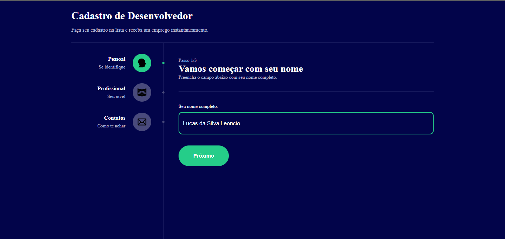
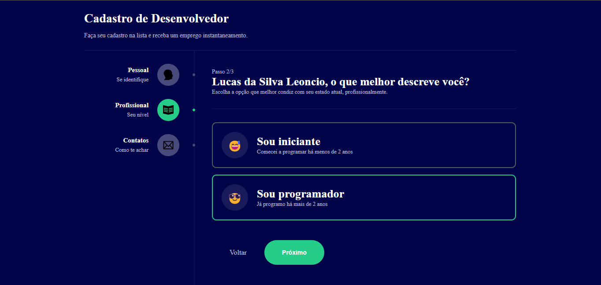
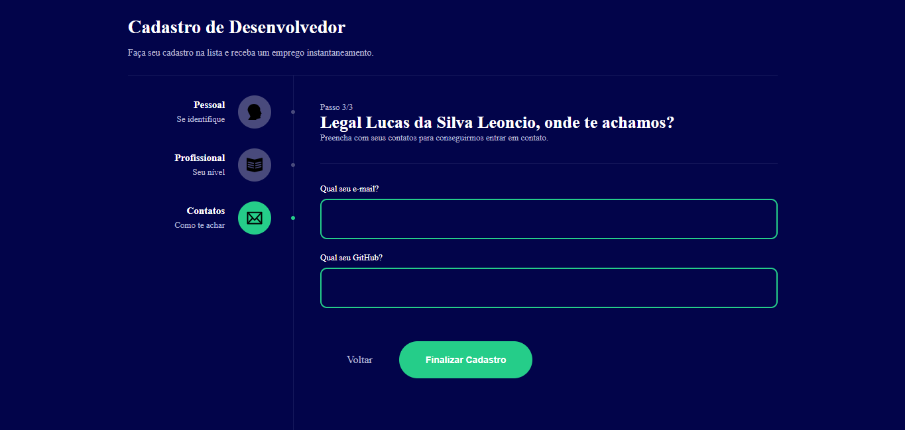

# MultiForm

Projeto simples para receber e armazenar as informações que o usuário digitar.

## Descrição: 

-> Este projeto é um módulo das classes React do B7Web. Neste projeto eu me concentro em praticar minha organização de pastas e o uso dos princípios do React.

[x] Assets -> Pasta responsável por conter as imagens e ícones utilizados nos projetos. 
[x] Components -> Pasta contendo os componentes do projeto. 
[x] context -> Contém a configurações da comunicação entre as telas usando Context API. 
[x] Pages -> Região que contém as páginas do projeto. 
[x] Types -> Região que contém todos as tipagens do projeto. 

### Assets:

-> Nesse caso, essa pasta contém apenas os ícones utilizados. No caso, deslike, like, seta e ícone da logo.

### Components: 

-> Header contém a estrutura do cabeçalho da página. 
-> Theme visa estruturar e padronizar o layout de todas as páginas, pois possuem o mesmo design. 
-> SideBarItem visa estrutarar cada elemento do side bar em elementos menores, pois eles possuem o mesmo padrão. 
-> SelectOption é um componente para estruturar o elemento de escolha do passo 2.  

### Contexts: 

-> FormContex.tsx visa estabelecer a comunicação entre as páginas, permitindo uma dinâmica mais inclusiva e ilustrativa. Além disso, armazene e modele os dados de cada página usando o Reducer.

### Pages:

-> Ele contém apenas uma página, a home neste caso, que é responsável por estruturar o app.

### OBS: 

Este projeto é responsivo.

